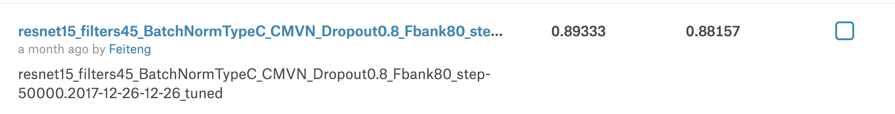
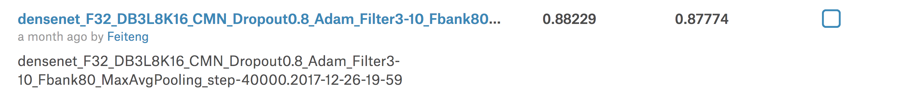

# TF_SpeechRecoChallenge
solutions for https://www.kaggle.com/c/tensorflow-speech-recognition-challenge

* based on [TensorFlow - exmaples - speech_commands](https://github.com/tensorflow/tensorflow/tree/master/tensorflow/examples/speech_commands)

# install
`(sudo) pip install -e .`


# key results
```
data_dir=~/Data/TF_Speech/speech_commands
test_dir="/home/ftli/Data/TF_Speech/test"
batch_size=48
```
## 1. conv LeaderBoard 0.77
* Sainath T N, Parada C. Convolutional neural networks for small-footprint keyword spotting[C]//Sixteenth Annual Conference of the International Speech Communication Association. 2015.


```
# conv 0.77
bash run.sh --mode train --model conv \
	--data_dir $data_dir --test_dir $test_dir \
  --hparams ""  --train-opts "" \
  --suffix "" --batch_size $batch_size \
  --opt "{ name: Adam, params: {} }" \
  --training_steps  "25000,25000" --skip-infer false \
  --learning_rate "0.01,0.001" --use-gpu true --feature_scaling ''
```

## 2. [improved-resnet](https://github.com/lifeiteng/TF_SpeechRecoChallenge/blob/master/speech/model_resnet.py#L210) LeaderBoard 0.89 (basic 0.85)
* Tang R, Lin J. Deep Residual Learning for Small-Footprint Keyword Spotting[J]. arXiv preprint arXiv:1710.10361, 2017.

##### No FeatureScale + BatchNorm (The paper's architecture): LB < 0.1
##### No FeatureScale + remove BatchNorm : LB 0.84
##### No FeatureScale + Add BN after input + BatchNorm: LB 0.86
##### FeatureScale(centered mean) + BatchNorm: LB 0.85

### improvements : LB 0.89333(private) 0.88157(public)
   + dropout
   + feature scale: centered mean (e.g. cmn)
   + [First Conv: kernel_size=(3, 10), strides=(1, 4)](https://github.com/lifeiteng/TF_SpeechRecoChallenge/blob/master/speech/model_resnet.py#L256)
   + use [MaxPool + AvgPool](https://github.com/lifeiteng/TF_SpeechRecoChallenge/blob/master/speech/model_resnet.py#L330)


```
# LB 0.89
dropout=0.8
hparams="resnet_filters=45,resnet_type=c,add_batch_norm=True,add_first_batch_norm=False,freeze_first_batch_norm=False"
suffix="15_filters45_BatchNormTypeC_CMN_Dropout${dropout}_Fbank80"

bash run.sh --mode train --model resnet \
	--data_dir $data_dir --test_dir $test_dir \
  --hparams "$hparams"  --train-opts "--dropout_prob $dropout --dct_coefficient_count 80 --feature_type fbank" \
  --suffix "$suffix" --batch_size $batch_size \
  --opt "{ name: Adam, params: {} }" \
  --training_steps  "25000,25000" --skip-infer false \
  --learning_rate "0.01,0.001" --use-gpu true --feature_scaling 'cmn'
```


## 3. [improved-densenet](https://github.com/lifeiteng/TF_SpeechRecoChallenge/blob/master/speech/model_resnet.py#L367) LeaderBoard 0.88 (basic 0.86)
* Huang G, Liu Z, Weinberger K Q, et al. Densely connected convolutional networks[C]//Proceedings of the IEEE conference on computer vision and pattern recognition. 2017, 1(2): 3.

* improvements (same as resnet)


```
for l in 8;do
	for k in 16;do
		hparams="add_first_batch_norm=True,freeze_first_batch_norm=False,inital_filters=32,dense_blocks=3,num_layers=${l},growth_rate=${k},add_bottleneck_layer=False,theta=1"
		suffix="_F32_DB3L${l}K${k}_CMN"
		echo '========= $suffix ========='
		bash run.sh --mode train --model densenet \
			--data_dir $data_dir --test_dir ${test_dir} \
			--hparams "$hparams" \
			--suffix "$suffix" \
			--opt "{ name: Adam, params: {} }" \
			--training_steps  "10000,10000,10000,10000" --skip-infer false \
			--learning_rate "0.01,0.001,0.0005,0.0001" --use-gpu true --feature_scaling 'cmn' || exit 1
	done
done
```

## 4. ensemble 0.89745
* spent little time on it.


## 5. data argument
* tried changing speed / pitch, but got a little achievement.
